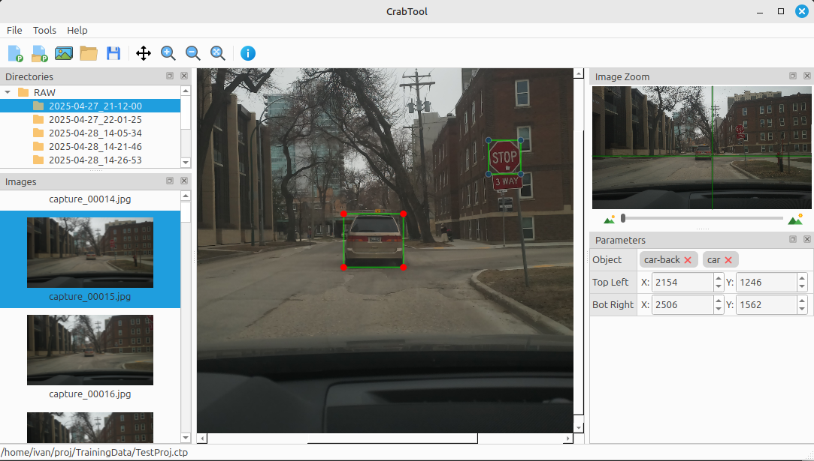
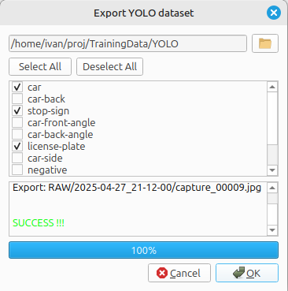
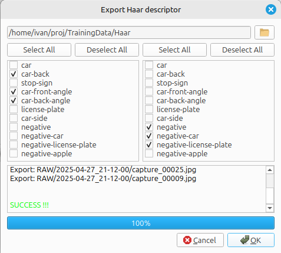

# Crab Tool

**Crab Tool** is a lightweight Qt-based image tagging tool designed for fast and simple annotation workflows.
Crab Tool supports export to YOLO and Haar training datasets, so it can be used for preparing data for AI models trainig. 

## Features

- Projects with tagging data
- Objects tagging
- Export to YOLO training dataset
- Export to Haar training descriptors
- Fast directory scanning
- Thumbnail previews
- Zoom, pan, and navigate image collections
